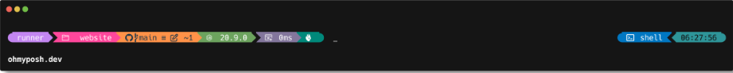

# Windows Terminal and Powershell Customizations
Repository containing all the customizations made on Windows Terminal and Powershell.

### Table of contents
+ Windows Terminal
+ Powershell

## Windows Terminal
> Every time you do a step, reload Windows Terminal for changes to take effect

1. Install Windows Terminal
1. Set inside Defaults the Transparency at 93%
1. Install [Nerd Fonts](https://github.com/ryanoasis/nerd-fonts) fonts and change it in the PowerShell Appereance section.
1. Install Oh-My-Posh using the command
```	
winget install JanDeDobbeleer.OhMyPosh
```
1. Restart Windows Terminal and then run `oh-my-posh` inside the Terminal
1. Open your PS Profile with `notepad $PROFILE` and insert this code inside it
```
oh-my-posh --init --shell pwsh --config ~/AppData/Local/Programs/oh-my-posh/themes/jandedobbeleer.omp.json | Invoke-Expression
```
1. Restart Windows Terminal one last time!
1. A this point it should look like this



## Powershell
notepad $PROFILE
oh-my-posh --init --shell pwsh --config ~/AppData/Local/Programs/oh-my-posh/themes/my-custom-theme.omp.json | Invoke-Expression
Import-Module -Name Terminal-Icons


https://dev.to/ansonh/customize-beautify-your-windows-terminal-2022-edition-541l
